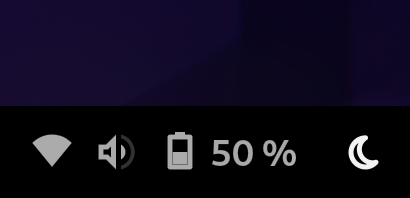

# Suspend Button (aka Tap to Sleep)
   
> A simple button on the far-right side of your top (or bottom) panel that suspends your device.

 

## Installation
1) Download the latest archive from [Releases](https://github.com/FaridZelli/gnome-shell-extension-tap-to-sleep/releases)
2) Extract the `tap-to-sleep@FaridZelli` folder   
   to `~/.local/share/gnome-shell/extensions/`
3) Logout of GNOME, then log back in and enable "Suspend Button" in GNOME extensions

Note: This extension is a fork of Inka Sokołowska's [Power Buttons](https://github.com/InkaAlicja/gnome-extension-power-buttons).   
Additionally, **Suspend Button** is compatible with touchscreens.
